# This is a multienv project for testing the application using the docker compose and depoying it to the localhost

# We have a repo which we forked and tested it on the local so that we can verify and start to build the docker images and run the docker ccompose up --build.

    # steps involved in testing the things locally

    # Set the .env files in each services
    cd to backend/dev
    create .env

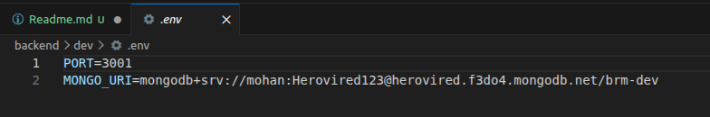

    cd to backend/prod
    create .env

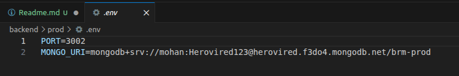

    cd backedn/dev
    pip install -r requirements.txt
    python3 app.py
    http://localhost:3001

    cd backend/prod
    pip install -r requirements.txt
    python3 app.py
    http://localhost:3002

    cd frontend
    npm install
    npm start
    http://localhost:3000

# Then we start writing the dockerfiles for each three services in their root folders

    # 1. cd backend/dev
    Write the Dockerfile
    # 2. cd backedn/prod
    Write the Dockerfile
    # 3. cd frontend
    Write the Dockerfile
    # 4. cd.. to the project root folder
    Write the docker-compose.yml

# From the root of the project where we have the docker compose file
Run
    docker compose up --build
    
    # It will start all the 5 containers required for this app to run, we can verify the running resources from the docker commands as below

    docker compose ps
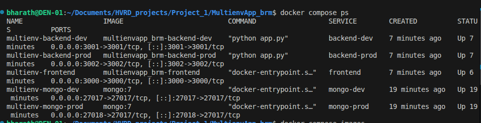

    docker compose images
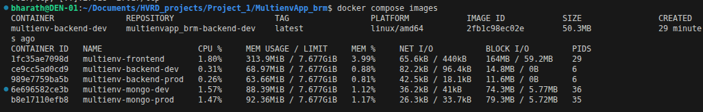

    we can also run and see the other resources like
    docker volume ls
    docker network ls
    docker stats
    to even further keep an eye on the docker resources

# Now we can verify the application running and working correctly on the browser
    1. http://localhost:3001        # Dev backend service

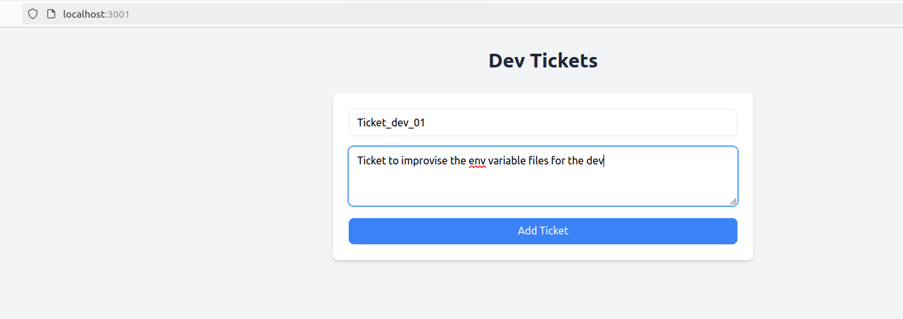
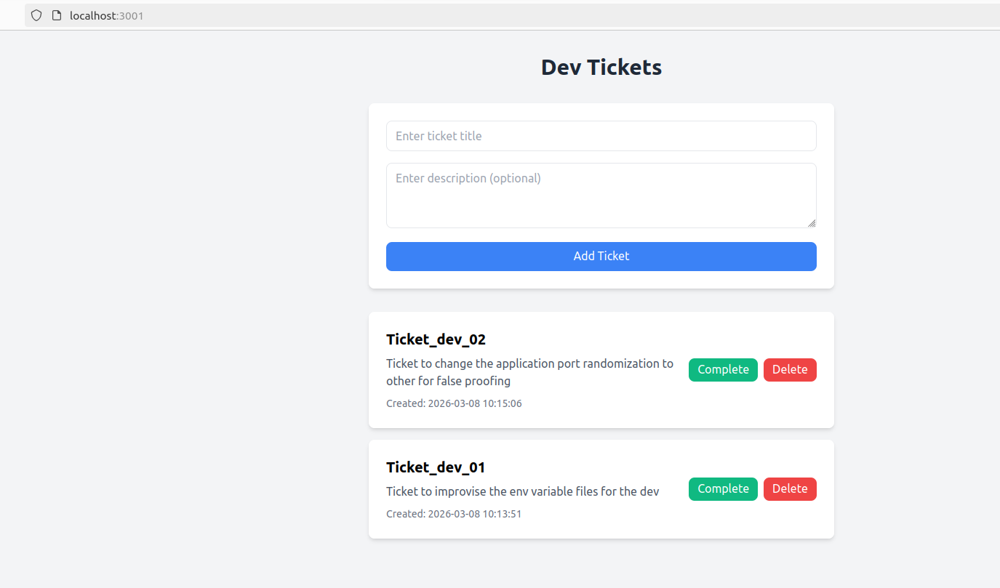

    2. http://localhost:3002        # prod backend service

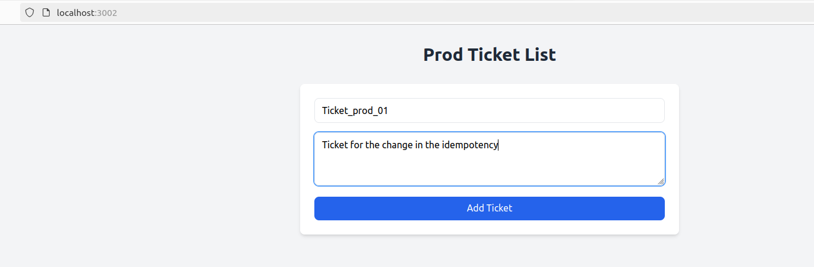
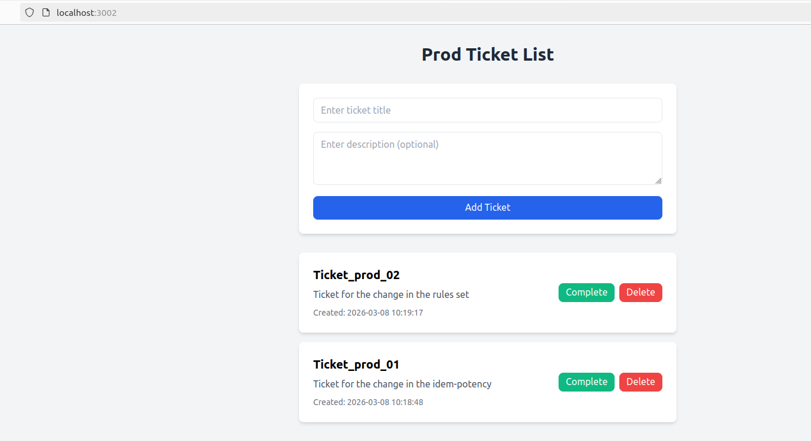

    3. http://localhost:3002        # frontend service

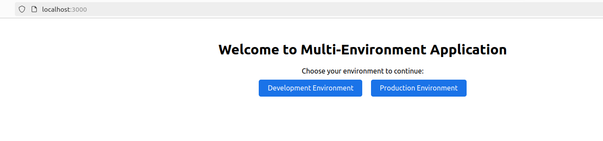
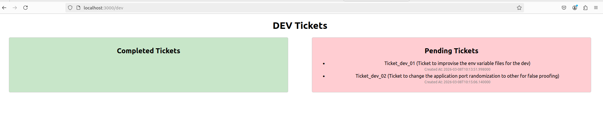
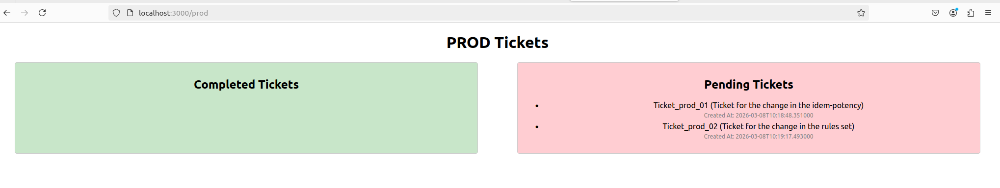

    # so this confirms that our data is being moving good between the services and we haave all of them working so lets make the pending ticket to completed and see if they coms to the completed section
    
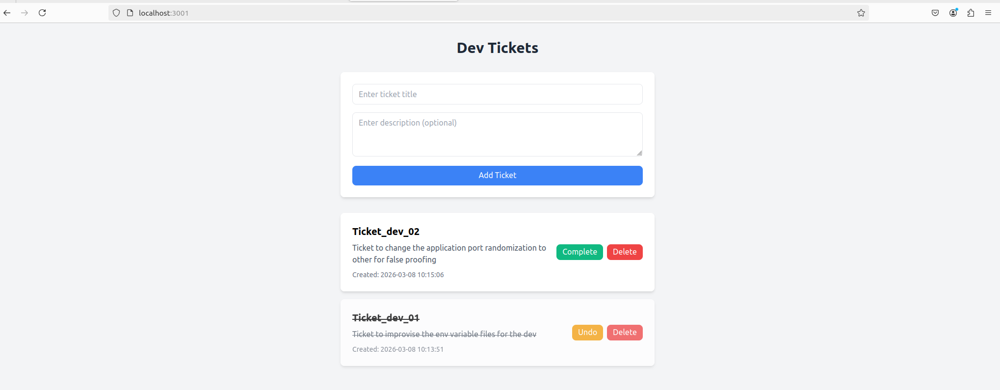
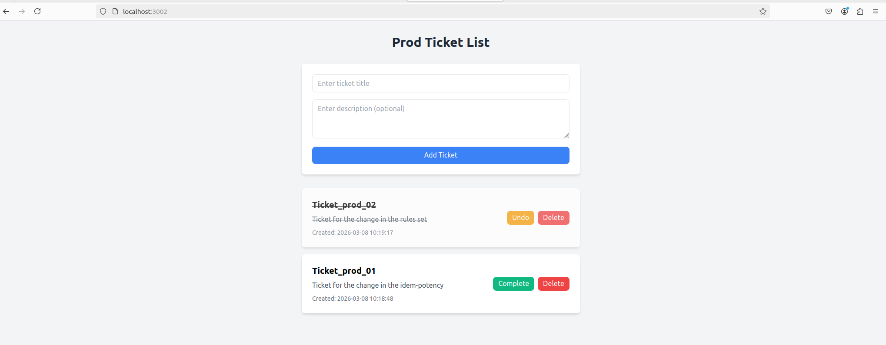
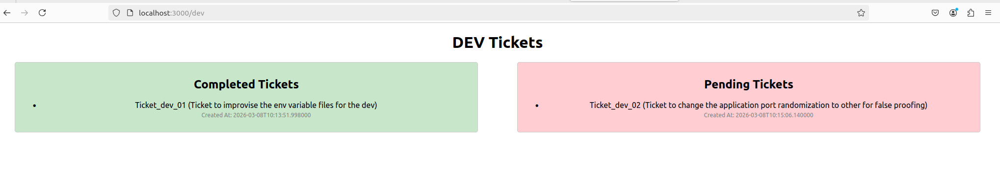
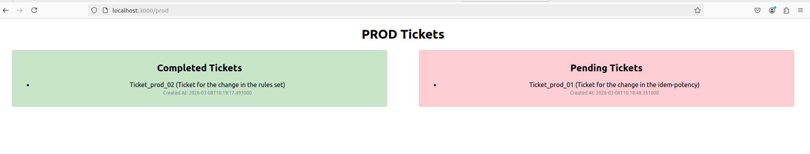

# so this concludes the assignment by verifying the things are working fine

